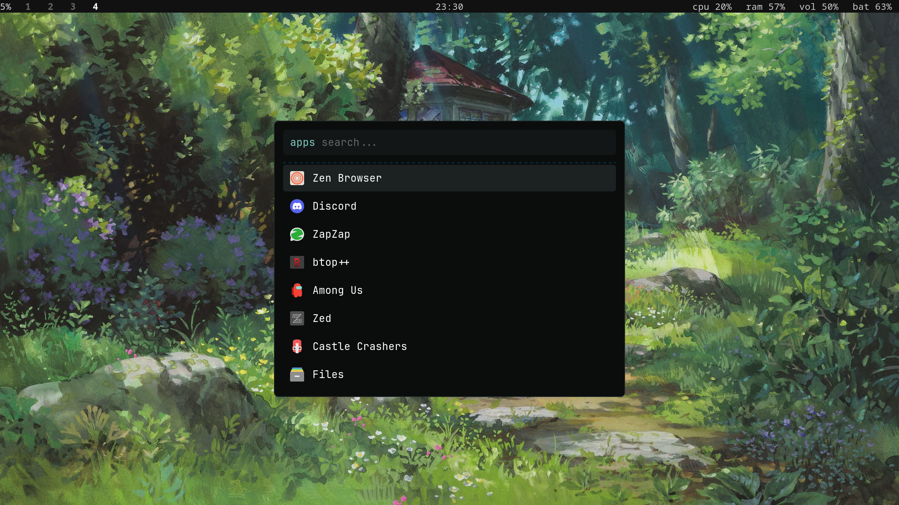

# rstl.sway ⋅ 458 MiB desktop

ultra lean & minimalistic sway config (based on arch linux) for those who want to make the most of their screen space while keeping all the features and storage space (optimized for laptops)



this setup includes but is not limited to:
- window manager
- minimal bar
- launcher
- notifications
- lf file manager
- lock screen
- screenshots
- clipboard history
- neovim text editor
- multimedia codecs
- audio protocols
- network manager
- login screen
- papirus icon theme
- [fsh](https://github.com/pingu-hq/fsh) menu

and several more features, such as [polkit authentication](https://github.com/arozoid/rstlpk) + dssd secret service + xdg portal integration. (~0.93 GiB full size on base arch linux install)

## installation

installation is rather easy:

```bash
git clone https://github.com/arozoid/rstl.sway.git/ ~/.config/rstl.sway/
cd ~/.config/rstl.sway/
./install.sh
```

follow the steps to select what you wanna do and not do, and that's basically it. after installation, the net installation size is ~

### manual install

prefer doing everything by hand? see [MANUAL_INSTALL.md](MANUAL_INSTALL.md)

## programs

- awww: lightweight wallpaper daemon
- yambar ([rstl.repo](https://github.com/arozoid/rstl.repo)): modular status bar for wayland
- sway: tiling window manager
- mako: lightweight notification daemon
- rofi: minimal and customizable launcher

---

- grim/slurp: screenshot tools
- wl-clipboard/cliphist: wayland clipboard
- greetd/tuigreet: ultra minimal greet program
- ttf-jetbrains-mono-nerd-min ([rstl.repo](https://github.com/arozoid/rstl.repo))/noto-fonts-emoji: for terminal and other apps
- papirus-icon-theme-dark-only ([rstl.repo](https://github.com/arozoid/rstl.repo)): for rofi launcher and other utilities

---

- bluez/networkmanager: set up for minimal arch install
- flac/mpg123/opus/vorbis/dav1d/libvpx/openh264: audio & video codecs
- pipewire/*: audio stack
- dssd ([rstl.repo](https://github.com/arozoid/rstl.repo)): dead simple freedesktop secret service
- rstlpk ([rstl.repo](https://github.com/arozoid/rstl.repo)): our own minimal polkit auth agent (no gtk; prompt in foot)
- xdg-desktop-portal-termfilechooser ([rstl.repo](https://github.com/arozoid/rstl.repo)): file pickers open in lf

---

- foot: fast, feature-rich terminal (rust)
- lf: terminal file manager (used by the file chooser portal)
- nvim: vim alternative
- fish: friendly interactive shell

## keybinds

- win+d: rofi launcher
- win+enter: foot terminal
- win+shift+s: screenshot to clipboard and Pictures/Screenshots/*
- win+backspace: power menu (3x2 grid, wlogout-style)

---

- win+f: fullscreen window
- win+e: split windows horizontally/vertically
- win+w: tabbed window layout
- win+space: float window

---

- win+shift+q: kill window
- win+hjkl/arrow keys: move between windows
- win+shift+hjkl/arrow keys: move focused window
- win+1-9: move to workspace 1-9
- win+shift+1-9: move focused window to workspace 1-9

---

- win+shift+r: resize mode
    - hjkl/arrow keys: directional window resize
    - win+escape/return: back to default mode
    - win+shift+r: back to default mode
    - mouse: manually resize windows

---

- keyboard f1-12 function keys: desktop actions (lower/higher brightness, keyboard backlight, volume, etc)
- win+r: reload config

## credits

[melatonia/meloworld-dotfiles](https://github.com/melatonia/meloworld-dotfiles) for various desktop sounds (usb connect/remove and chime startup) and the cozy wallpaper selection :3
