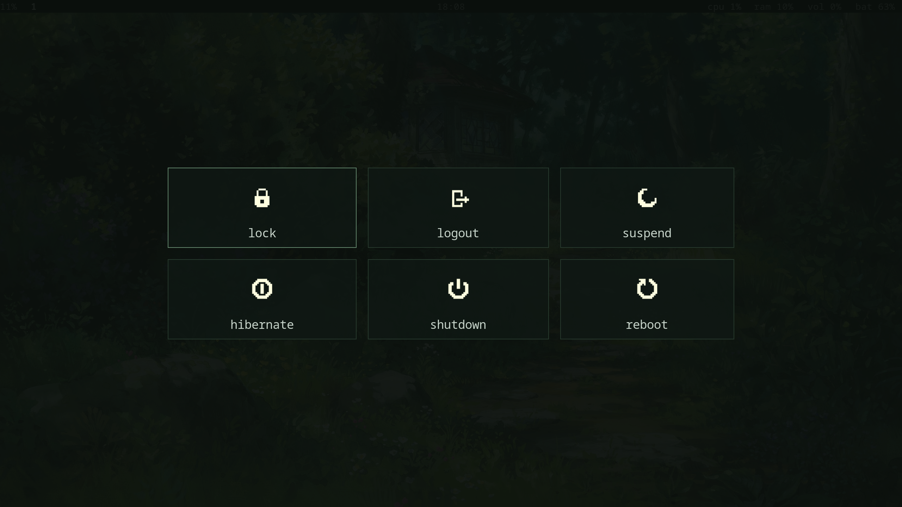

# rstl.sway

ultra minimalistic sway config (based on arch linux) for those who want to make the most of their screen space (optimized for laptops)




## installation

installation is rather easy:

```bash
git clone https://github.com/arozoid/rstl.sway.git/ ~/.config/rstl.sway/
cd ~/.config/rstl.sway/
./install.sh
```

follow the steps to select what you wanna do and not do, and that's basically it.

## programs

- awww: lightweight wallpaper daemon
- waybar: heavily customizable navigation bar
- sway: tiling window manager
- mako: lightweight notification daemon
- rofi: minimal and customizable launcher
- wlogout: customizable power menu

---

- grim/slurp: screenshot tools
- wl-clipboard/cliphist: wayland clipboard
- greetd/tuigreet: ultra minimal greet program
- ttf-jetbrains-mono-nerd/noto-fonts-emoji: for terminal and other apps

---

- bluez/networkmanager: set up for minimal arch install
- ffmpeg/gstreamer/*: video / multimedia codec base
- pipewire/pavucontrol/*: audio stack
- gnome-keyring (optional): secret session API

---

- ghostty: customizable and stylized terminal
- nvim: vim alternative
- fish: friendly interactive shell

## keybinds

- win+d: rofi launcher
- win+enter: ghostty terminal
- win+shift+s: screenshot to clipboard and Pictures/Screenshots/*
- win+backspace: wlogout

---

- win+f: fullscreen window
- win+e: split windows horizontally/vertically
- win+w: tabbed window layout
- win+space: float window

---

- win+shift+q: kill window
- win+hjkl/arrow keys: move between windows
- win+shift+hjkl/arrow keys: move focused window
- win+1-9: move to workspace 1-9
- win+shift+1-9: move focused window to workspace 1-9

---

- win+shift+r: resize mode
    - hjkl/arrow keys: directional window resize
    - win+escape/return: back to default mode
    - win+shift+r: back to default mode
    - mouse: manually resize windows

---

- keyboard f1-12 function keys: desktop actions (lower/higher brightness, keyboard backlight, volume, etc)
- win+r: reload config

## credits

[melatonia/meloworld-dotfiles](https://github.com/melatonia/meloworld-dotfiles) for various desktop sounds (usb connect/remove and chime startup) and the cozy wallpaper selection :3
