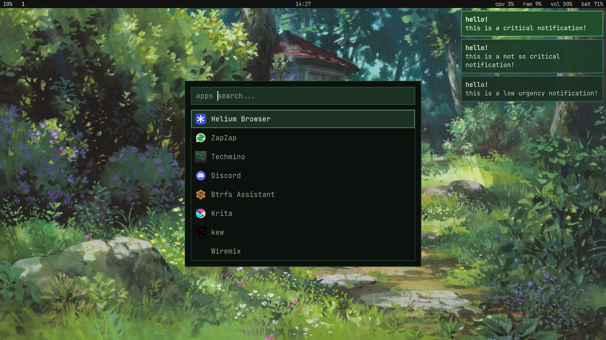

# rstl.sway ⋅ ~0.8 GiB desktop

ultra lean & minimalistic sway config (based on arch linux) for those who want to make the most of their screen space while keeping all the features, storage space, and resources (optimized for laptops)



this setup includes but is not limited to:
- window manager (sway)
- minimal bar (yambar)
- launcher (rofi)
- notifications (mako)
- file manager (spf / rovr)
- emoji / unicode / nerd emoji picker (latuicon)
- audio mixer (wiremix)
- bluetooth management (bluetui)
- clipboard history & interface (clipse)
- calculator (eva)
- lock screen (swaylock)
- screenshots (grim / slurp)
- text editor (neovim / micro)
- multimedia codecs
- audio protocols
- network manager (nmtui)
- login screen (tuigreet)
- browser (firefox)
- [rstl-pick](https://github.com/arozoid/rstl-pick) app picker

and several more features, such as [polkit authentication](https://github.com/arozoid/rstlpk) + dssd secret service + xdg portal integration. (full rootfs: \~1.0 GiB installed; a bare arch base install is \~0.2 GiB, so the desktop itself adds \~0.8 GiB over base)

## installation

installation is rather easy:

```bash
git clone https://github.com/arozoid/rstl.sway.git/ ~/.config/rstl.sway/
cd ~/.config/rstl.sway/
./bin/install.sh
```

follow the steps to select what you wanna do and not do, and that's basically it. after installation, the net installed rootfs is \~1.0 GiB (\~0.8 GiB of desktop on top of a \~0.2 GiB arch base install)

### manual install

prefer doing everything by hand? see [MANUAL_INSTALL.md](MANUAL_INSTALL.md)

### editions

three editions share one set of dotfiles, each with its own installer and its own package list, so you can move between them without rewriting anything:

| edition | installer | package list | what you get |
| --- | --- | --- | --- |
| install | `bin/install.sh` | `packages-install.txt` | the full desktop (57 core packages) |
| install-min | `bin/install-min.sh` | `packages-install-min.txt` | the same without the editor and the extras (56) |
| install-base | `bin/install-base.sh` | `packages-install-base.txt` | no editor, no lock/idle, no clipboard daemon (38) |

the lists are plain text, one package per line, and you are free to edit them. the sections are `#@core` (one atomic transaction), `#@optional` (one at a time, so one failure does not abort the rest), `#@program:vim` / `#@program:mouse` and `#@firefox`. all three installers take the same flags:

| flag | what it does |
| --- | --- |
| `--yes`, `-y` | no questions |
| `--program vim` / `--program mouse` | which program the edition is for (recorded) |
| `--firefox` / `--no-firefox` | include or skip the browser (recorded) |
| `--no-cleanup` | skip the size cleanup (orphan removal, pacman cache purge) - this is what `rstl update` uses, since cleanup is an image-build optimization and not something to run on a live desktop |
| `--help`, `-h` | the list, on your terminal |

`install-base.sh` has no program, so it accepts `--program` and records `program=none`.

### updating

after a git pull, or on a machine that installed from an ISO:

```bash
rstl update.sh
```

`bin/update.sh` fetches the repository (`git pull --ff-only` in place when `~/.config/rstl.sway` is a checkout, otherwise a fresh `--depth 1` clone), runs `pacman -Syu`, and re-runs your edition's installer with `--yes --no-cleanup`: every package of your edition ends up installed and current, and the dotfiles are re-copied. reload sway afterwards with win+shift+c.

| flag | what it does |
| --- | --- |
| `--edition`, `--flavor` | update a different edition than the installed one |
| `--program vim\|mouse` | re-apply with another program |
| `--firefox` / `--no-firefox` | re-apply with or without the browser |
| `--no-upgrade` | skip `pacman -Syu` (dotfiles only) |
| `--yes`, `-y` | no questions |
| `--dir PATH` | act on another dotfiles directory |
| `--repo URL` | fetch from another repository |
| `--help`, `-h` | the list, on your terminal |

which edition is installed, and with which program, is written from scratch to `~/.config/rstl.sway/.rstl-edition` on every installer run and read back by `update.sh`. it is git-ignored: it describes the machine, not the repository.

### the `rstl` command

every edition installs a small wrapper as `/usr/local/bin/rstl`, so any script in `bin/` runs by name from anywhere:

```bash
rstl install.sh --yes      # reinstall this edition
rstl update.sh             # update packages + dotfiles
rstl install-min.sh        # switch to the minimal edition
```

everything after the script name is passed through untouched.

### configuring sway

`sway/config` holds what you are not likely to change: the variables, the keybindings and the window rules. the settings live in `sway/config.d/`, one file per topic, included in name order at the bottom of `sway/config`:

| file | what is in it |
| --- | --- |
| `10-appearance.conf` | borders, gaps, client colors |
| `20-cursor.conf` | cursor theme (the only place it is written down: `scripts/auto-scale.sh` reads it from here to re-apply the theme with a size computed from the panel's physical size) |
| `25-displays.conf` | where per-output settings go, and why the scale is not hardcoded here |
| `30-input.conf` | mouse and focus behavior |
| `40-autostart.conf` | what runs at login and on every reload |

add a file of your own (`50-mine.conf`) or edit one of these, and commit it: the installers purge `sway/config.d` and copy it again, so the repository is the only source of truth and a setting you deleted in git stops applying. reload with win+shift+c, or check a config before reloading with `sway -C -c ~/.config/sway/config`.

## programs

- awww: lightweight wallpaper daemon
- yambar ([rstl.repo](https://github.com/arozoid/rstl.repo)): modular status bar for wayland
- sway: tiling window manager
- mako: lightweight notification daemon
- rofi: minimal and customizable launcher (used for app picker and power menu)

---

- grim/slurp: screenshot tools
- wl-clipboard: wayland clipboard manager
- greetd/tuigreet: ultra minimal greet program
- ttf-jetbrains-mono-nerd-min ([rstl.repo](https://github.com/arozoid/rstl.repo)) / noto-fonts-emoji: fonts for terminal and other apps
- papirus-icon-theme-dark-only ([rstl.repo](https://github.com/arozoid/rstl.repo)) / hicolor-icon-theme: icons for rofi launcher and other utilities

---

- bluez/networkmanager: set up for minimal arch install
- flac/mpg123/opus/vorbis/dav1d/libvpx/openh264: audio & video codecs
- pipewire/*: audio stack
- dssd ([rstl.repo](https://github.com/arozoid/rstl.repo)): dead simple freedesktop secret service
- rstlpk ([rstl.repo](https://github.com/arozoid/rstl.repo)): my minimal polkit auth agent (no gtk; prompt in foot)
- xdg-desktop-portal-termfilechooser ([rstl.repo](https://github.com/arozoid/rstl.repo)): file pickers open in the first of superfile / rovr / lf that is installed

---

- foot: fast, feature-rich terminal (rust)
- nvim: vim alternative
- micro: customizable nano alternative
- zsh: highly customizable shell

---

- eva: simple and capable REPL calculator
- latuicon ([rstl.repo](https://github.com/arozoid/rstl.repo)): emoji / kaomoji / unicode / nerd font symbol TUI picker
- clipse ([rstl.repo](https://github.com/arozoid/rstl.repo): clipboard history and TUI manager 
- rovr ([rstl.repo](https://github.com/arozoid/rstl.repo)): post-modern terminal file explorer, used by the file chooser if installed 
- superfile: a fancy and modern terminal file manager, prioritized by the file chooser if installed
- bluetui: bluetooth TUI manager

## keybinds

- win+d: rofi launcher
- win+enter: foot terminal
- win+shift+s: screenshot to clipboard and Pictures/Screenshots/*
- win+backspace: power menu (3x2 grid, wlogout-style)
- win+o: rstl-pick (calculator, file manager, bluetooth, wifi, etc.)

---

- win+f: fullscreen window
- win+e: split windows horizontally/vertically
- win+w: tabbed window layout
- win+space: float window

---

- win+shift+q: kill window
- win+hjkl/arrow keys: move between windows
- win+shift+hjkl/arrow keys: move focused window
- win+1-9: move to workspace 1-9
- win+shift+1-9: move focused window to workspace 1-9

---

- win+r: resize mode
    - hjkl/arrow keys: directional window resize
    - escape/return: back to default mode
    - win+r: back to default mode
    - mouse: manually resize windows
- win+lmb (left mouse button): move windows with the mouse
- win+rmb (right mouse button): resize windows with the mouse

---

- keyboard f1-12 function keys: desktop actions (lower/higher brightness, keyboard backlight, volume, etc)
- win+shift+c: reload config

## credits

[melatonia/meloworld-dotfiles](https://github.com/melatonia/meloworld-dotfiles) for the chime startup desktop sound and the default wallpaper :3

[firstrib/firstrib](https://gitlab.com/firstrib/firstrib) for the "firstrib" initrd and for some initrd and frugal install scripts (which i had remastered for this repo)

[CachyOS](https://cachyos.org) for the CachyOS kernel and the linux-cachyos-bore base for [rstl.linuz](https://github.com/arozoid/rstl.linuz)!
